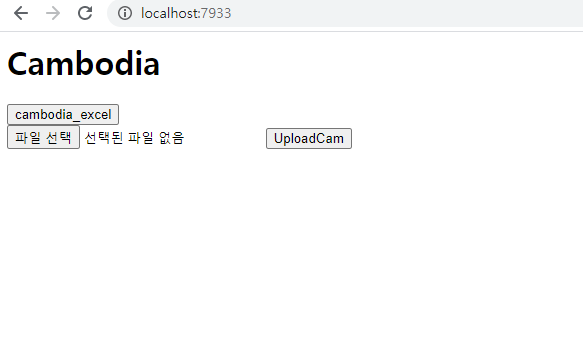
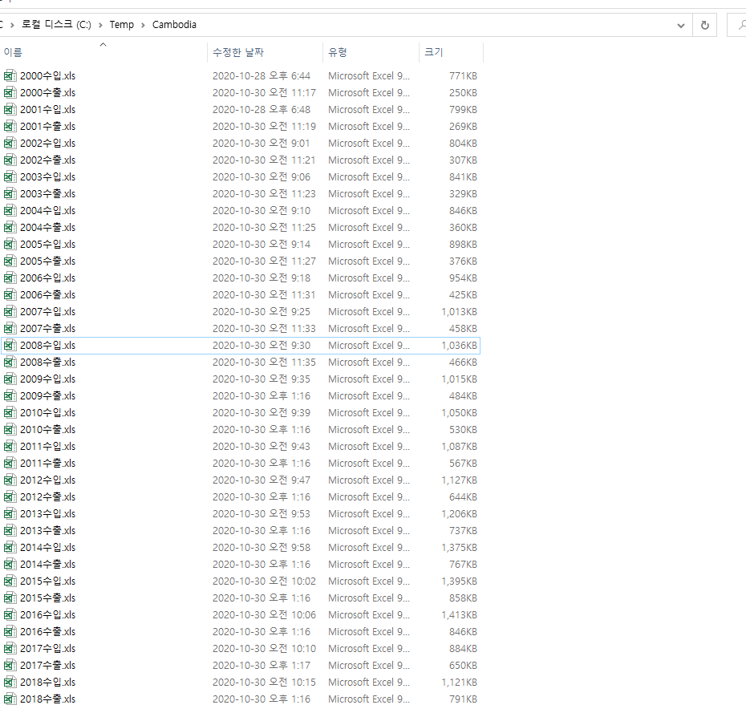

# CambodiaStatistics

## 개발 목적

- 과제 수행 중 대량의 데이터 수집 과정 문제 발생
- 수천건의 옵션을 설정해가며 사이트에서 데이터를 개별로 받아야 하는 상황 인지
- 해당 사이트에서 Get형식으로 REST API 이용 중인것을 확인
- 요청 값을 바꾸며 데이터를 받아 엑셀에 저장시키는  프로그램 제작

## 구성

## 진행 프로세스

- 사이트에서 제공하는 수입, 수출 품목에 대한 엑셀 다운로드
- 받은 파일을 선택 후 UploadCam 버튼을 통한 getListAddExcelCambodia 호출
- getListAddExcelCambodia 는 해당 목록을 모두 DB 저장
- 완료 후 cambodia_excel 버튼을 통한 cambodia 호출
- cambodia는 해당 품목 별 나라 관계를 가진 데이터 oec.wordl에 재요청 후 엑셀 형태로 데이터 추출

## 문제점

- 데이터 요청 값의 분류에 따른 잦은 반복
- DB 저장 속도 문제 (해결 : 한 개의 트랜잭션으로 묶음)
- 수행과제의 1회성 결과물을 위한 제작
- 변수 선언 및 코드의 직관성 포기
